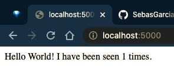

# Get started

```bash
docker network create docker_cp_intro_network
docker build -t sebasgarciamo/python-redis-intro .
docker run -p 6379:6379 -d --network docker_cp_intro_network -h redis redis
docker run -p 5000:5000 -d --network docker_cp_intro_network docker_cp_intro_img
```

# Evidence

