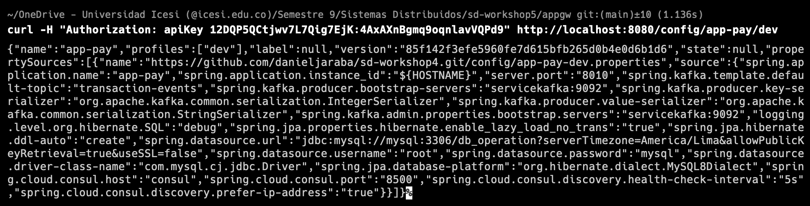
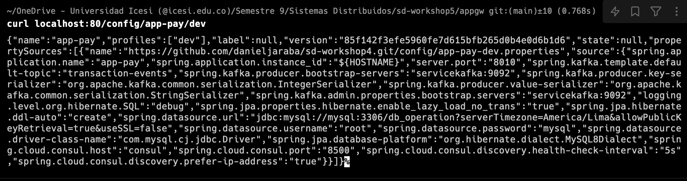
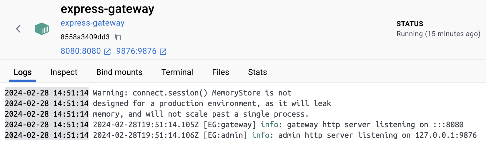
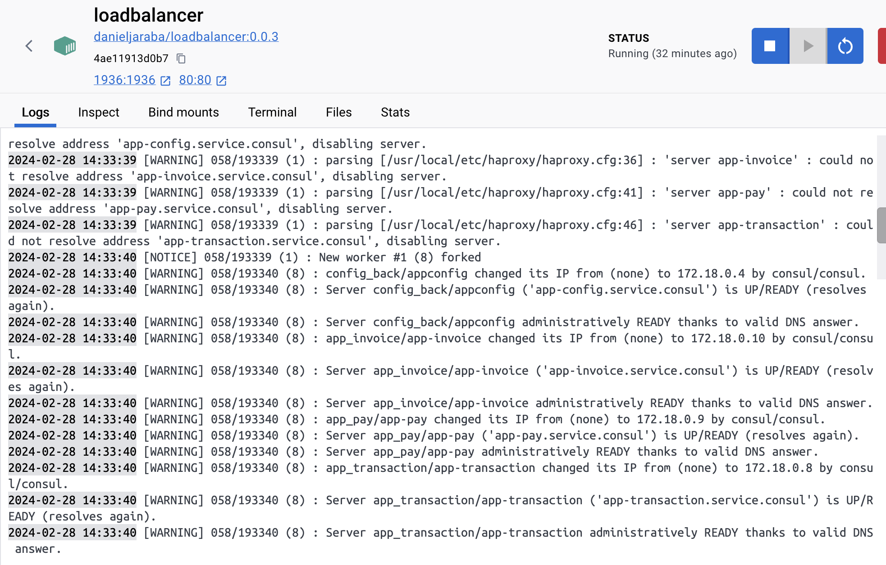

# sd-workshop5

Daniel Jaraba

1. Edit the haproxy.cfg file from the folder haproxy to meet the requeriments of the program
2. Create the docker image for the loadbalancer with the Dockerfile in the folder haproxy

```
docker build -t loadbalancer:0.0.1 .
```

3. Run the loadbalancer

```
docker run -d -p 80:80 -p 1936:1936 --network distribuidos --name loadbalancer loadbalancer:0.0.1
```

4. Run the database redis for the application gateway with the following command

```
docker run --network distribuidos -d --name express-gateway-data-store -p 6379:6379 redis:alpine
```

5. Edit the gateway.config.yml file to meet the requeriments
6. Run the express gateway considering the location of the gateway.config.yml file

```
docker run -d --name express-gateway--network distribuidos -v .:/var/lib/eg -p 8080:8080 -p 9876:9876 express-gateway
```

7. Register in the gateway accesing to the terminal of the service

```
eg users create
```

8. Assign auth key to the account in the terminal of the service

```
eg credentials create -c username -t key-auth -q
```

## Proof






