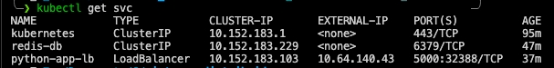
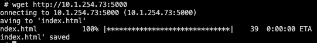

# Get started

```bash
docker pull sebasgarciamo/python-redis-intro
# Enable load balancer
microk8s enable metallb:10.64.140.43-10.64.140.96  
cd kubernetes/deployments
kubectl create -f python-app.yaml
kubectl create -f redis-db.yaml
```
# Evidences




# sd-workshop5
Here
