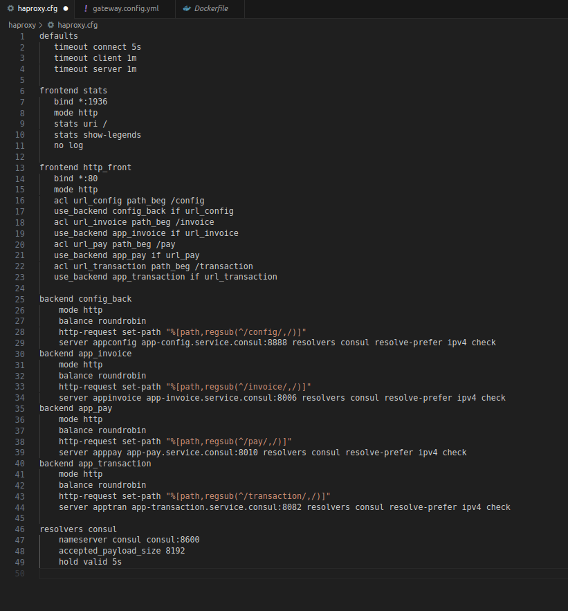
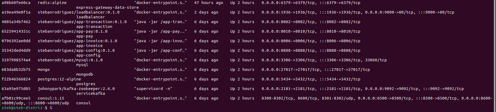
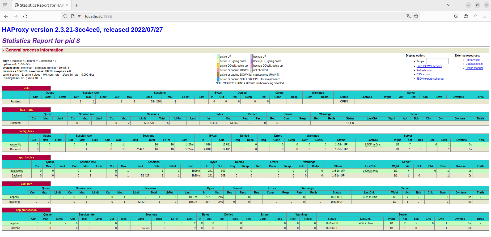
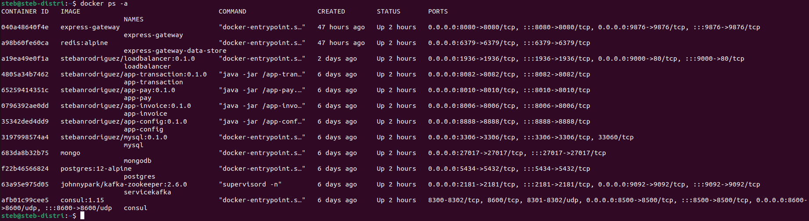
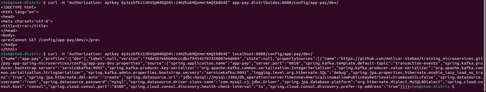
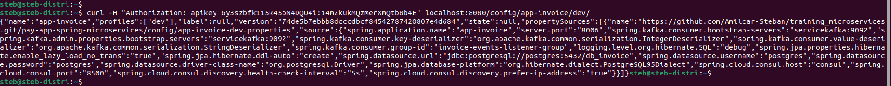
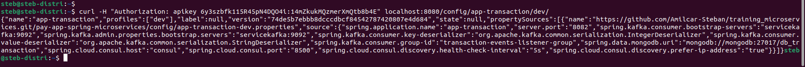

# Workshop 5

This workshop guides you through the setup and configuration of a LoadBalancer using haproxy, along with the creation of a gateway to manage external requests. Follow the steps below to ensure a successful setup.

## LoadBalancer Configuration

Configure the LoadBalancer, which is a haproxy in this case. Edit its configuration file to enable communication with microservices and ensure proper traffic distribution.

[]

Build the LoadBalancer image named `stebanrodriguez/loadbalancer:0.1.0` using the following command:

```bash
docker build -t stebanrodriguez/loadbalancer:0.1.0 .
```

After creating the image, run it on the 'distribuidos' network, exposing ports 9000 (for local use) and 80 (for LoadBalancer). Additionally, expose port 1936 for monitoring.

```bash
docker run -d -p 9000:80 -p 1936:1936 --network distribuidos --name loadbalancer stebanrodriguez/loadbalancer:0.1.0
```

Verify that the services are running correctly.

[]

Check the LoadBalancer behavior from the browser using `localhost:1936`, the exposed port for the balancer.

[]

## Gateway Configuration

Configure the gateway, responsible for receiving external requests and deciding where to redirect them. Edit the `gateway.conf.yml` file in the 'appgw' folder to define endpoints for each microservice.

[]

Run the gateway container on the 'distribuidos' network, creating a volume for non-volatile storage. Expose ports 8080 and 9876.

```bash
docker run -d --name express-gateway --network distribuidos -v $(pwd):/var/lib/eg -p 8080:8080 -p 9876:9876 express-gateway
```

Ensure the containers are running correctly.

[]

Create an admin user within the gateway container using the following commands:

```bash
docker exec -it express-gateway sh
/ # eg users create
/ # eg credentials create -c distribuidos -t key-auth -q
```

Use `curl` to verify communication with each endpoint using the created user and token.

For 'app-pay':

```bash
curl -H "Authorization: apikey 6y3szbfk115R45pN4DQO4i:14mZkukMQzmerXmQtb8b4E" localhost:8080/config/app-pay/dev/
```

[]

For 'app-invoice':

```bash
curl -H "Authorization: apikey 6y3szbfk115R45pN4DQO4i:14mZkukMQzmerXmQtb8b4E" localhost:8080/config/app-invoice/dev/
```

[]

For 'app-transaction':

```bash
curl -H "Authorization: apikey 6y3szbfk115R45pN4DQO4i:14mZkukMQzmerXmQtb8b4E" localhost:8080/config/app-transaction/dev/
```

[]
